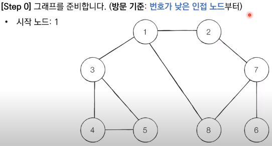

## Chapter 3 그리디

### 거스름돈

* 손님에게 거슬러 줘야 할 돈이 N원일 때 거슬러줘야 할 동전의 최소 개수를 구하라. 단, 거슬러 줘야 할 돈 N은 항상 10의 배수이다.

```python
# 거슬러 줘야 할 동전의 최소 개수를 구하라.
# 거스름돈 총 금액
n = 1260
count = 0	# 동전의 개수 넣을 변수
# 큰 단위의 화폐부터 차례대로 확인
coin_types = [500, 100, 50, 10]
for coin in coin_types:
    count += n // coin
    n %= coin
print(count)
# 실행 결과
6개
```


### 큰 수의 법칙

* 첫째 줄에 N(2 ≤ N ≤ 1000), M(1 ≤ M ≤ 10000), K(1 ≤ K ≤ 10000)의 자연수가 주어지며, 각 자연수는 공백으로 구분한다.
* 입력으로 주어지는 K는 항상 M보다 작거나 같다. 

```python
n, m, k = map(int, input().split())
data = list(map(int, input().split()))

data.sort()
first = data[n-1]
second = data[n-2]
result = 0
while True:
    for i in range(k):
        if m == 0:
            break
        result += first
        m -= 1
    if m == 0:
        break
    result += second
    m -= 1
print(result)
```


### 지뢰찾기(Minesweeper)

```python
row, col = map(int, input().split())
matrix = []
for i in range(row):
    matrix.append(list(input()))

print('입력 결과 확인:')
for i in matrix:
    for j in i:
        print(j, end='')
    print()
print('입력 결과 수정 후:')
for i in range(row):
    for j in range(col):
        if matrix[i][j] == '*':
            print(matrix[i][j], end='')
        else:
            count = 0
            for x in range(i-1, i+2):
                for y in range(j-1, j+2):
                    if x <0 or y < 0 or x >= row or y >= col:
                        continue
                    elif matrix[x][y] == '*':
                        count += 1
            print(count, end='')
    print()
# 실행 결과

```


### 숫자 카드 게임

* 숫자 카드 조건

1. 숫자가 쓰인 카드들이 N X M 형태로 놓여 있다. 이때 N: 행의 개수 M: 열의 개수
2. 먼저 뽑고자 하는 카드가 포함되어 있는 행을 선택
3. 선택된 행에 포함된 카드들 중 가장 숫자가 낮은 카드를 뽑아야 한다.
4. 처음에 카드를 골라낼 행을 선택할 때, 이후에 가장 숫자가 낮은 카드를 뽑을 것을 고려하여 최종적으로 가장 높은 숫자의 카드를 뽑을 수 있도록 전략을 세워야 한다.

```python
# 나의 방법
n, m = map(int, input().split())
matrix = []
for i in range(n):
    matrix.append(list(map(int, input().split())))
# 입력 결과 확인
print('입력 결과 확인:')
for i in matrix:
    for j in i:
        print(j, end=' ')
    print()
# 검사
min = 0
min_list = []
for i in range(n):
    min = matrix[i][0]
    print('min', min)
    for j in range(m):
        if matrix[i][j] < min:
            min = matrix[i][j]
    min_list.append(min)
print(max(min_list))

# 책의 방법
# min() 함수를 이용하는 답안
n, m = map(int, input().split())
result = 0
for i in range(n):
    data = list(map(int, input().split()))
    min_val = min(data)
    result = max(result, min_val)
print('결과:', result)
# 2중 반복문 구조를 이용하는 답안 예시
n, m = map(int, input().split())
result = 0
for i in range(n):
    data = list(map(int, input().split()))
    min_val = 1000
    for a in data:
        min_val = min(min_val, a)
    result = max(result, min_val)
print(result)
```


### 1이 될 때까지

* N에서 1을 뺀다.
* N을 K로 나눈다.

```python
# 내 풀이 방법
n, k = map(int, input().split())
count = 0
while True:
    if n == 1:
        break
    if n % k != 0:
        n -= 1
        count += 1
    elif n % k == 0:
        n//=k
        count += 1
print(count)
# method 1
n, k = map(int, input().split())
result = 0
# N이 K 이상이라면 K로 계속 나누기
while n >= k:
    # N이 K로 나누어 떨어지지 않는다면 N에서 1씩 빼기
    while n % k != 0:
        n -= 1
        result += 1
    n //= k
    result += 1
# 마지막으로 나눈 수에 대하여 1씩 빼기
while n > 1:
    n -= 1
    result += 1
print(result)
# method 2
# N이 K의 배수가 되도록 효율적으로 한 번에 빼는 방식
n, k = map(int, input().split())
result = 0

while True:
    # (N == K 로 나누어 떨어지는 수)가 될 때까지 1씩 빼기
    target = (n // k) *k
    result += (n - target)
    n = target
    # N이 K보다 작을 때(더 이상 나눌 수 없을 때) 반복문 탈출
    if n < k:
        break
    # K로 나누기
    result += 1
    n //= k
# 마지막으로 남은 수에 대하여 1씩 빼기
result += (n - 1)
print(result)
```


### Check Palindrome

```python
# inputString = "abcba"
inputString = "abca"
# result = False
inputString = list(inputString)
# method 1 use if, else statement
# if inputString == inputString[::-1]:
#     print(True)
# else:
#     print(False)
# method 2 use ternary operators(삼항 연산자)
result = (True if inputString == inputString[::-1] else False)
print(result)
```


### 상하좌우(Up Down Left Right)

* 계획서에는 하나의 줄에 띄어쓰기를 기준으로 하여 L, R, U, D 중 하나의 문자가 반복적으로 적혀 있다. 각 문자의 의미는 다음과 같다.
  * L: 왼쪽으로 한 칸 이동
  * R: 오른쪽으로 한 칸 이동
  * U: 위로 한 칸 이동
  * D: 아래로 한 칸 이동

* 첫째 줄에 공간의 크기를 나타내는 N이 주어진다. (1 ≤ N ≤ 100)
* 둘째 줄에 여행자 A가 이동할 계획서 내용이 주어진다. (1 ≤ 이동 횟수 ≤ 100)

```python
n = int(input())
move_plans = input().split()
x, y = 1, 1
dx = [0, 0, -1, 1]
dy = [-1, 1, 0, 0]
move_types = ['L', 'R', 'U', 'D']

for plan in move_plans:
    for i in range(len(move_types)):
        if plan == move_types[i]:
            nx = x + dx[i]
            ny = y + dy[i]
    if nx < 1 or ny < 1 or nx > n or ny > n:
        continue
    x, y = nx, ny
print('최종 결과:')
print(x, y)
# 입력
5
R R R U D D
# 실행 결과
최종 결과:
3 4
```

* 오류 정리: `n = input()`이라고 했을 때 `if nx < 1 or ny < 1 or nx > n or ny > n:`이 부분에서 이런 에러가 난다.

```python
Traceback (most recent call last):
  File "4-1.py", line 12, in <module>
    if nx < 1 or ny < 1 or nx > n or ny > n:
TypeError: '>' not supported between instances of 'int' and 'str'
```

* 그러므로 항상 데이터 타입 체크해주고 여기는 `n = int(input())`로 수정해준다.


### 시각

* 정수 N이 입력되면 00시 00분 00초부터 N시 59분 59초까지의 모든 시각 중에서 3이 하나라도 포함되는 모든 경우의 수를 구하는 프로그램을 작성하시오. 예를 들어 1을 입력했을 때 다음은 3이 하나라도 포함되어 있으므로 세어야 하는 시각이다.
  * 00시 00분 03초
  * 00시 13분 30초
* 반면에 다음은 3이 하나도 포함되어 있지 않으므로 세면 안 되는 시각이다.
  * 00시 02분 55초
  * 01시 27분 45초

* 입력 조건: 첫째 줄에 정수 N이 입력된다.(0 ≤ N ≤ 23)
* 출력 조건: 00시 00분 00초부터 N시 59분 59초까지의 모든 시각 중에서 3이 하나라도 포함되는 모든 경우의 수를 출력한다.
* `if '3' in <str>time:`이 핵심이다.

```python
# 다음 중 시각에 3이 하나라도 포함되어 있으면 세어라.
n = int(input())
result = 0
for h in range(n+1):
    for m in range(60):
        for s in range(60):
            if '3' in str(h) + str(m) + str(s):
                result += 1
print(result)
# 입력
5
# 실행 결과
11475
```


### 왕실의 나이트

* 이처럼 8 X 8 좌표 평면상에서 나이트의 위치가 주어졌을 때 나이트가 이동할 수 있는 경우의 수를 출력하는 프로그램을 작성하시오. 이때 왕실의 정원에서 행 위치를 표현할 때는 1부터 8로 표현하며, 열 위치를 표현할 때는 a부터 h로 표현된다.

* 예를 들어 만약 나이트가 a1에 있을 때 이동할 수 있는 경우의 수는 다음 2가지이다. a1의 위치는 좌표 평면에서 구석의 위치에 해당하며 나이트는 정원의 밖으로는 나갈 수 없기 때문이다.

  1. 오른쪽으로 두 칸 이동 후 아래로 한 칸 이동하기(c2)

  2. 아래로 두 칸 이동 후 오른쪽으로 한 칸 이동하기(c3)

* ord 함수는 문자열을 아스키 코드로 변환해준다. 

```python
# 왕실의 나이트
input_data = input()
row = int(input_data[1])
column = int(ord(input_data[0])) - int(ord('a')) + 1

steps = [(-2, -1), (-1, -2), (1, -2), (2, -1), (2, 1), (1, 2), (-1, 2), (-2, 1)]
result = 0
for step in steps:
    next_row = row + step[1]
    next_column = column + step[0]
    if next_row >= 1 and next_row <= 8 and next_column >= 1 and next_column <= 8:
        result += 1
print(result)
```


### 게임 개발

* 첫째 줄에 맵의 세로 크기 N과 가로 크기 M을 공백으로 구분하여 입력한다. (3 ≤ N, M ≤ 50)
* 둘째 줄에 게임 캐릭터가 있는 칸의 좌표 (A, B)와  바라보는 방향 d가 각각 서로 공백으로 구분하여 주어진다. 방향 d의 값으로는 다음과 같이 4가지가 존재한다.
  * 0: 북쪽
  * 1: 동쪽
  * 2: 남쪽
  * 3: 서쪽


### DFS(Depth First Search) - 깊이 우선 탐색

* DFS는 깊이 우선 탐색이라고도 부르며, 그래프에서 **깊은 부분을 우선적으로 탐색하는 알고리즘**이다.

* 그래프(Graph)의 기본 구조는 노드(Node)와 간선(Edge)으로 표현되며 이때 노드를 정점(Vertex)이라고도 말한다.

* 프로그래밍에서 그래프는 크게 2가지 방식으로 표현할 수 있는데 코딩 테스트에서는 이 두 방식 모두 필요하니 두 개념에 대해 바르게 알고 있도록 하자.

  * 인접 행렬(Adjacency Matrix): 2차원 배열로 그래프의 연결 관계를 표현하는 방식

  * 인접 리스트(Adjacency List): 리스트로 그래프의 연결 관계를 표현하는 방식

```python
# example of Adjacency Matrix
INF = 999999999

# 2차원 리스트를 이용해 인접 행렬 표현
graph = [
    [0, 7, 5],
    [7, 0, INF],
    [5, INF, 0]
]

print(graph)

# example of Adjacency List
# 행(row)이 3개인 2차원 리스트로 인접 리스트 표현
graph = [[] for _ in range(3)]

# 노드 0에 연결된 노드 정보 저장(노드, 거리)
graph[0].append((1, 7))
graph[0].append((2, 5))

# 노드 1에 연결된 노드 정보 저장(노드, 거리)
graph[1].append((0, 7))
# 노드 2에 연결된 노드 정보 저장(노드, 거리)
graph[2].append((0, 5))

print(graph)

```

* DFS는 **스택 자료구조(혹은 재귀 함수)**를 이용하며 구체적인 동작 과정은 다음과 같습니다.

1. 탐색 시작 노드를 스택에 삽입하고 방문 처리를 한다.

2. 스택의 최상단 노드에 방문하지 않은 인접한 노드가 하나라도 있으면 그 인접 노드를 스택에 넣고 방문 처리합니다. 방문하지 않은 인접 노드가 없으면 스택에서 최상단 노드를 꺼냅니다.
3. 더 이상 2번의 과정을 더 이상 수행할 수 없을 때까지 반복한다.

※ '방문 처리'는 스택에 한 번 삽입되어 처리된 노드가 다시 삽입되지 않게 체크하는 것을 의미한다. 방문 처리를 함으로써 각 노드를 한 번씩만 처리할 수 있다.




* DFS를 이용해 노드의 탐색 순서 구하기

```python
# DFS 메서드 정의
def dfs(graph, v, visited):
    # 현재 노드를 방문 처리
    visited[v] = True
    print(v, end=' ')
    # 현재 노드와 연결된 다른 노드르르 재귀적으로 방문
    for i in graph[v]:
        if not visited[i]:
            dfs(graph, i, visited)

# 각 노드가 연결된 정보를 리스트 자료형으로 표현(2차원 리스트)
graph = [
    [],
    [2, 3, 8],
    [1, 7],
    [1, 4, 5],
    [3, 5],
    [3, 4],
    [7],
    [2, 6, 8],
    [1, 7]
]

# 각 노드가 방문된 정보를 리스트 자료형으로 표현(1차원 리스트)
visited = [False] * 9
# 정의된 DFS 함수 호출
dfs(graph, 1, visited)
```


### BFS(Breadth First Search) - 너비 우선 탐색

* 가까운 노드부터 탐색하는 알고리즘
* BFS는 큐 자료구조를 이용하며 구체적인 동작 과정은 다음과 같다.

1. 탐색 시작 노드를  큐에 삽입하고 방문 처리를 한다.
2.  큐에서 노드를 꺼내 해당 노드의 인접 노드 중에서 방문하지 않은 노드를 모두 큐에 삽입하고 방문 처리를 한다.
3. 2번의 과정을 더 이상 수행할 수 없을 때까지 반복한다.

※ 코딩 테스트에서는 보통 DFS보다는 BFS 구현이 조금 더 빠르게 동작한다는 정도로 기억하자.

```python
from collections import deque
# BFS 정의
def bfs(graph, start, visited):
    # 큐(Queue) 구현을 위해 deque 라이브러리 사용
    queue = deque([start])
    # 현재 노드를 방문 처리
    visited[start] = True
    # 큐가 비어질 때까지 반복
    while queue:
        # 큐에서 하나의 원소를 뽑아 출력
        v = queue.popleft()
        print(v, end='')
        # 해당 원소와 연결된, 아직 방문하지 않은 원소들을 큐에 삽입
        for i in graph[v]:
            if not visited[i]:
                queue.append(i)
                visited[i] =  True
# 각 노드가 연결된 정보를 리스트 자료형으로 표현(2차원 리스트)
graph = [
    [],
    [2, 3, 8],
    [1, 7],
    [1, 4, 5],
    [3, 5],
    [3, 4],
    [7],
    [2, 6, 8],
    [1, 7]
]
# 각 노드가 방문된 정보를 리스트 자료형으로 표현(1차원 리스트)
visited = [False] * 9
# 정의된 BFS 함수 호출
bfs(graph, 1, visited)
```


### 선택 정렬(Selection Sort)

* 이 중에서 가장 작은 데이터를 선택해 맨 앞에 있는 데이터와 바꾸고, 그 다음 작은 데이터를 선택해 앞에서 두 번째 데이터와 바꾸는 과정을 반복하면 어떨까? → 가장 작은 것을 선택

```python
# Selection Sort
array = [7, 5, 9, 0, 3, 1, 6, 2, 4, 8]
for i in range(len(array)):
    min_idx = i
    for j in range(i+1, len(array)):
        if array[min_idx] > array[j]:
            min_idx = j
	array[i], array[min_idx] = array[min_idx], array[i]
print(array)
# 실행 결과
[0, 1, 2, 3, 4, 5, 6, 7, 8, 9]
```


### 삽입 정렬(Insertion Sort)

* 데이터를 하나씩 확인하며, 각 데이터를 적절한 위치에 삽입

* 자기보다 작은 데이터를 만나면 그 위치에서 멈춤

```python
# Insertion Sort
array = [7, 5, 9, 0, 3, 1, 6, 2, 4, 8]
for i in range(1, len(array)):
    for j in range(i, 0, -1):
        if array[j] < array[j-1]:
            array[j], array[j-1] = array[j-1], array[j]
        else:
            break
print(array)
# 실행 결과
[0, 1, 2, 3, 4, 5, 6, 7, 8, 9]
```


### 퀵 정렬(Quick Sort)

* 기준 데이터를 설정하고 그 기준보다 큰 데이터와 작은 데이터의 위치를 바꾸면 어떨까?

* 퀵 정렬에서는 피벗이 사용된다. 큰 숫자와 작은 숫자를 교환할 때, 교환하기 위한 `기준`을 의미한다.

```python
array = [5, 7, 9, 0, 3, 1, 6, 2, 4, 8]
def quick_sort(array, start, end):
    if start >= end:
         return
    pivot = start
    left = start + 1
    right = end
    while left <= right:
        while left <= end and array[left] <= array[pivot]:
            left += 1
        while right > start and array[right] >= array[pivot]:
            right -= 1
        if left > right:
            array[right], array[pivot] = array[pivot], array[right]
        else:
            array[left], array[right] = array[right], array[left]
    quick_sort(array, start, right - 1)
    quick_sort(array, right + 1, end)

quick_sort(array, 0, len(array) - 1)
print(array)
```


### 계수 정렬(Counting sort)

```python
# 모든 원소의 값이 0보다 크거나 같다고 가정
array = [7, 5, 9, 0, 3, 1, 6, 2, 9, 1, 4, 8, 0, 5, 2]
# 모든 범위를 포함하는 리스트 선언(모든 값은 0으로 초기화)
count = [0] * (max(array) + 1)
for i in range(len(array)):
    # 각 데이터에 해당하는 인덱스의 값 증가
    count[array[i]] += 1
    
# 리스트에 기록된 정렬 정보 확인
for i in range(len(count)):
    for j in range(count[i]):
        # 띄어쓰기를 구분으로 등장한 횟수만큼 인덱스 출력
        print(i, end=' ')
```


### 위에서 아래로(print array sort in reverse)

※ 입력 조건

* 첫째 줄에 수열에 속해 있는 수의 개수 N이 주어진다. (1 ≤ N ≤ 500)
* 둘째 줄부터 N + 1 번째 줄까지 N개의 수가 입력된다. 수의 범위는 1이상 100,000 이하의 자연수이다.

※ 출력 조건

* 입력으로 주어진 수열이 내림차순으로 정렬된 결과를 공백으로 구분하여 출력한다. 동일한 수의 순서는 자유롭게 출력해도 괜찮다.

```python
n = int(input())

array = []
for i in range(n):
    array.append(int(input()))
print(array)
array = sorted(array, reverse=True)
for i in array:
    print(i, end=' ')
```


### 성적이 낮은 순서로 학생 출력하기

※ 입력 조건

* 첫 번째 줄에 학생의 수 N이 입력된다. (1 ≤ N ≤ 100,000)
* 두 번째 줄부터 N + 1 번째 줄에는 학생의 이름을 나타내는 문자열 A와 학생의 성적을 나타내는 정수 B가 공백으로 구분되어 입력된다. 문자열 A의 길이와 학생의 성적은 100 이하의 자연수이다.

※ 출력 조건

* 모든 학생의 이름을 성적이 낮은 순서대로 출력한다. 성적이 동일한 학생들의 순서는 자유롭게 출력해도 괜찮다.

```python
# N을 입력받기
n = int(input())
# N명의 학생 정보를 입력받아 리스트에 저장
array = []
for i in range(n):
    input_data = input().split()
    array.append((input_data[0], input_data[1]))
# 키(Key)를 이용하여, 정수를 기준으로 정렬
array = sorted(array, key=lambda student: student[1], reverse=True)
# 정렬이 수행된 결과를 출력
for student in array:
    print(student[0], end=' ')
# 입력
2
홍길동 95
이순신 77
# 실행 결과
홍길동 이순신
```


### Sequential Search(순차탐색)

```python
def sequential_search(n, target, array):
    for i in range(n):
        if array[i] == target:
            return i + 1

print("생성할 원소 개수를 입력한 다음 한 칸 띄고 찾을 문자열을 입력하세요.")
input_data = input().split()
n = int(input_data[0])
target = input_data[1]

print("앞서 적은 원소 개수만큼 문자열을 입력하세요. 구분은 띄어쓰기 한 칸으로 합니다.")
array = input().split()

print(sequential_search(n, target, array))
```


### 이진탐색(Binary Search)

* 재귀 함수로 구현한 이진 탐색 소스코드

```python

if start > end:
    return None

def binary_search(array, target , start, end):
    if start > end:
        return None
    mid = (start + end) // 2

    if array[mid] == target:
        return mid
    elif array[mid] > target:
        return binary_search(array, target, start, mid - 1)
    else:
        return binary_search(array, target, mid + 1, end)
    
n, target = list(map(int, input().split()))
array = list(map(int, input().split()))
result = binary_search(array, target, 0, n-1)
if result == None:
    print("원소가 존재하지 않습니다.")
else:
    print(result + 1)

```


* 피보나치 함수

```python
# 피보나치 함수를 재귀 함수로 구현
def fibo(x):
    if x == 1 or x == 2:
        return 1
    return fibo(x - 1) + fibo(x - 2)
print(fibo(4))
```


* 피보나치 수열 재귀적 소스코드

```python
d = [0] * 100
def fibo(x):
    if x == 1 or x == 2:
        return 1
    if d[x] != 0:
        return d[x]
    d[x] = fibo(x - 1) + fibo(x - 2)
    return d[x]
print(fibo(99))
```


* 피보나치 수열 반복적 소스코드

```python
d = [0] * 100
d[1] = 1
d[2] = 1
n = 6
for i in range(3, n+1):
    d[i] = d[i-1] + d[i-2]

print(d[n])
# 실행 결과
8
```


### 개미 전사

* 개미 전사는 부족한 식량을 충당하고자 메뚜기 마을의 식량창고를 몰래 공격하려고 한다. 메뚜기 마을에는 여러 개의 식량창고가 있는데 식량창고는 일직선으로 이어져 있다. 각 식량창고에는 정해진 수의 식량을 저장하고 있으며 개미 전사는 식량창고를 선택적으로 약탈하여 식량을 빼앗을 예정이다.

```markdown
{1, 3, 1, 5}
```

※ **입력 조건**

* 첫째 줄에 식량창고의 개수 N이 주어진다. (3 ≤ N ≤ 100)

* 둘째 줄에 공백으로 구분되어 각 식량창고에 저장된 식량의 개수 K가 주어진다. (0 ≤ K ≤ 1,000)

※ **출력 조건**

* 첫째 줄에 개미 전사가 얻을 수 있는 식량의 최댓값을 출력하시오.

```python
n = int(input())
array = list(map(int, input().split()))
d = [0] * 100
# 다이나믹 프로그래밍(Dynamic Programming) 진행(보텀업)
d[0] = array[0]
d[1] = max(array[0], array[1])
for i in range(2, n):
    d[i] = max(d[i-1], d[i-2] + array[i])
print(d[n-1])
```


## 최단경로

특정 지점까지 가장 빠르게 도달하는 방법을 찾는 알고리즘


### 다익스트라 최단 경로 알고리즘

* 다익스트라(Dijkstra) 최단 경로 알고리즘은 여러 개의 노드가 있을 때, 특정한 노드에서 출발하여 다른 노드로 가는 각각의 최단 경로를 구해주는 알고리즘이다.

1. 출발 노드를 설정한다.
2. 최단 거리 테이블을 초기화한다.
3. 방문하지 않은 노드 중에서 최단 거리가 가장 짧은 노드를 선택한다.
4. 해당 노드를 거쳐 다른 노드로 가는 비용을 계산하여 최단 거리 테이블을 갱신한다.
5. 위 과정에서 3과 4번을 반복한다.


#### 다익스트라 알고리즘을 구현하는 방법

방법1. 구현하기 쉽지만 느리게 동작하는 코드

방법2. 구현하기에 조금 더 까다롭지만 빠르게 동작하는 코드


### 다익스트라 vs 데이크스트라

```markdown
# 다익스트라 알고리즘을 고안한 에츠허르 다익스트라는 본래 네델란드 사람이라서 다익스트라의 정확한 외래어 표기는 '데이크스트라'가 맞다. 하지만, 이책을 읽는 독자는 대부분 다익스트라로 알고 있을 듯하여 이 책에서는 다익스트라로 표기하였다.
# 다른 책이나 문서에서 데이크스트라를 보면 같은 알고리즘이라는 점을 기억하길 바란다.
```


### 방법1. 간단한 다익스트라(Dijkstra) 알고리즘

* 단계마다 '방문하지 않은 노드 중에서 최단 거리가 가장 짧은 노드를 선택'하기 위해 매 단계마다 1차원 리스트의 모든 원소를 확인(순차 탐색)한다.

```python
# 간단한 다익스트라(Dijkstra) 알고리즘
import sys
input = sys.stdin.readline
# 무한을 의미하는 값으로 10억을 설정
INF = int(1e9)

# 노드의 개수, 간선의 개수를 입력받기
n, m = map(int, input().split())
# 시작 노드 번호를 입력받기
start = int(input())
# 각 노드에 연결되어 있는 노드에 대한 정보를 담는 리스트를 만들기
graph = [[] for i in range(n + 1)]
# 방문한 적이 있는지 체크하는 목적의 리스트를 만들기
visited = [False] * (n + 1)
# 최단 거리 테이블을 모두 무한으로 초기화
distance = [INF] * (n + 1)

for _ in range(m):
    a, b, c = map(int, input().split())
    # a번 노드에서 b번 노드로 가느는 비용이 c라는 의미
    graph[a].append((b, c))

# 방문하지 않은 노드 중에서, 가장 최단 거리가 짧은 노드의 번호를 반환
def get_smallest_node():
    min_value = INF
    index = 0 # 가장 최단 거리가 짧은 노드(인덱스)
    for i in range(1, n + 1):
        if distance[i] < min_value and not visited[i]:
            min_value = distance[i]
            index = i
    return index

def dijkstra(start):
    # 시작 노드에 대해서 초기화
    distance[start] = 0
    visited[start] = True
    for j in graph[start]:
        distance[j[0]] = j[1]
    # 시작 노드를 제외한 전체 n - 1개의 노드에 대해 반복
    for i in range(n - 1):
        # 현재 최단 거리가 가장 짧은 노드를 꺼내서, 방문 처리
        now = get_smallest_node()
        visited[start] = True
        # 현재 노드와 연결된 다른 노드를 확인
        for j in graph[now]:
            cost = distance[now] + j[i]
            # 현재 노드를 거쳐서 다른 노드로 이동하는 거리가 더 짧은 경우
            if cost < distance[j[0]]:
                distance[j[0]] = cost
            
# 다익스트라 알고리즘 수행
dijkstra(start)

# 모든 노드로 가기 위한 최단 거리를 출력
for i in range(1, n + 1):
    # 도달할 수 없는 경우, 무한(INFINITY)이라고 출력
    if distance[i] == INF:
        print("INFINITY")
    # 도달할 수 있는 경우 거리를 출력
    else:
        print(distance[i])
```


### 개선된 다익스트라 알고리즘

```python
# 개선된 다익스트라 알고리즘
import heapq
import sys
input = sys.stdin.readline
# 무한을 의미하는 값으로 10억을 설정
INF = int(1e9)

# 노드의 개수, 간선의 개수를 입력받기
n, m = map(int, input().split())
# 시작 노드 번호를 입력받기
start = int(input())
# 각 노드에 연결되어 있는 노드에 대한 정보를 담는 리스트를 만들기
graph = [[] for i in range(n + 1)]
# 최단 거리 테이블을 모두 무한으로 초기화
distance = [INF] * (n + 1)

# 모든 간선 정보를 입력받기
for _ in range(m):
    a, b, c = map(int, input().split())
    # a번 노드에서 b번 노드로 가는 비용이 c라는 의미
    graph[a].append((b, c))

def dijkstra(start):
    q = []
    # 시작 노드로 가기 위한 최단 경로는 0으로 설정하여, 큐에 삽입
    heapq.heappush(q, (0, start))
    distance[start] = 0
    # 큐가 비어있지 않으면
    while q:
        # 가장 최단 거리가 짧은 노드에 대한 정보 꺼내기
        dist, now = heapq.heappop(q)
        # 현재 노드가 이미 처리된 적이 있는 노드라면 무시
        if distance[now] < dist:
            continue
        # 현재 노드와 연결된 다른 인접한 노드들을 확인
        for i in graph[now]:
            cost = dist + i[1]
            # 현재 노드를 거쳐서, 다른 노드로 이동하는 거리가 더 짧은 경우
            if cost < distance[i[0]]:
                distance[i[0]] = cost
                heapq.heappush(q, (cost, i[0]))

# 다익스트라 알고리즘을 수행
dijkstra(start)
# 모든 노드로 가기 위한 최단 거리를 출력
for i in range(1, n + 1):
    # 도달할 수 없는 경우, 무한(INFINITY)이라고 출력
    if distance[i] == INF:
        print("INFINITY")
    # 도달할 수 있는 경우 거리를 출력
    else:
        print(distance[i])
# 실행 결과

```


### Floyd-Warshall Algorithm(플로이드 워셜 알고리즘)

```python
# 무한을 의미하는 값으로 10억을 설정
INF = int(1e9)

# 노드의 개수 및 간선의 개수를 입력받기
n = int(input())
m = int(input())

# 2차원 리스트(그래프 표현)를 만들고, 모든 값을 무한으로 초기화
graph = [[INF] * (n + 1) for _ in range(n + 1)]

# 자기 자신에서 자기 자신으로 가는 비용은 0으로 초기화
for a in range(1, n + 1):
    for b in range(1, n + 1):
        if a == b:
            graph[a][b] = 0

# 각 간선에 대한 정보를 입력받아, 그 값으로 초기화
for _ in range(m):
    # A에서 B로 가는 비용은 C라고 설정
    a, b, c = map(int, input().split())
    graph[a][b] = c

# 점화식에 따라 플로이드 워셜 알고리즘을 수행
for k in range(1, n + 1):
    for a in range(1, n + 1):
        for b in range(1, n + 1):
            graph[a][b] = min(graph[a][b], graph[a][k], graph[k][b])

# 수행된 결과를 출력
for a in range(1, n + 1):
    for b in range(1, n + 1):
        # 도달할 수 없는 경우, 무한(INFINITY)이라고 출력
        if graph[a][b] == INF:
            print("INFINITY", end=" ")
        # 도달할 수 있는 경우 거리를 출력
        else:
            print(graph[a][b], end=" ")
    print()

```


## 그래프 이론

### 서로소 집합 자료구조(Disjoint Sets Data Structure)

* 서로소 집합 자료구조: 서로소 부분 집합들로 나누어진 원소들의 데이터를 처리하기 위한 자료구조
* 서로소 집합 자료구조: union-find 자료구조라고 불리기도 한다.
  * union의 의미는 '합집합'이라는 의미(명사)도 있고, '합치기' 혹은 '합체'라는 의미(동명사)도 있다.

1. union(합집합) 연산을 확인하여, 서로 연결된 두 노드 A, B를 확인한다.
   1. A와 B의 루트 노드 A', B'를 각각 찾는다.
   2. A'를 B'의 부모 노드로 설정한다(B'가 A'를 가리키도록 한다). 
2. 모든 union(합집합) 연산을 처리할 때까지 1번 과정을 반복한다.

※ 각 원소는 그래프에서의 노드로 표현되고, '같은 집합에 속한다'는 정보를 담은 union 연산들은 간선으로 표현된다.

※ 번호가 작은 노드가 부모가 되고, 번호가 큰 노드가 자식이 된다.

```python
# 기본적인 서로소 집합 알고리즘
# 특정 원소가 속한 집합을 찾기
def find_parent(parent, x):
    # 루트 노드가 아니라면, 루트 노드를 찾을 때까지 재귀적으로 호출
    if parent[x] != x:
        return find_parent(parent, parent[x])
    return x

# 두 원소가 속한 집합을 합치기
def union_parent(parent, a, b):
    a = find_parent(parent, a)
    b = find_parent(parent, b)
    if a < b:
        parent[b] = a
    else:
        parent[a] = b

# 노드의 개수와 간선(union 연산)의 개수 입력받기
v, e = map(int, input().split())
parent = [0] * (v + 1) # 부모 테이블 초기화

# 부모 테이블상에서, 부모를 자기 자신으로 초기화
for i in range(1, v + 1):
    parent[i] = i

# union 연산을 각각 수행
for i in range(e):
    a, b = map(int, input().split())
    union_parent(parent, a, b)

# 각 원소가 속한 집합 출력
print('각 원소가 속한 집합: ', end='')
for i in range(1, v + 1):
    print(find_parent(parent, i), end=' ')
print()

# 부모 테이블 내용 출력
print('부모 테이블: ', end='')
for i in range(1, v + 1):
    print(parent[i], end=' ')
```


* 개선된 서로소 집합 알고리즘(improved disjoint sets algorithm)

```python
# 개선된 서로소 집합 알고리즘
# 특정 원소가 속한 집합을 찾기
def find_parent(parent, x):
    # 루트 노드가 아니라면, 루트 노드를 찾을 때까지 재귀적으로 호출
    if parent[x] != x:
        parent[x] = find_parent(parent, parent[x])
    return parent[x]

# 두 원소가 속한 집합을 합치기
def union_parent(parent, a, b):
    a = find_parent(parent, a, b)
    b = find_parent(parent, a, b)
    if a < b:
        parent[b] = a
    else:
        parent[a] = b

# 노드의 개수와 간선(union 연산)의 개수 입력받기
v, e = map(int, input().split())
# 부모 테이블 초기화
parent = [0] * (v + 1)

# 부모 테이블상에서, 부모를 자기 자신으로 초기화
for i in range(1, v + 1):
    parent[i] = i

# union 연산을 각각 수행
for i in range(e):
    a, b = map(int, input().split())
    union_parent(parent, a, b)

# 각 원소가 속한 집합 출력
print('각 원소가 속한 집합: ', end='')
for i in range(1, v + 1):
    print(find_parent(parent, i), end=' ')
print()

# 부모 테이블 내용 출력
print('부모 테이블: ', end='')
for i in range(1, v + 1):
    print(parent[i], end=' ')
```


* 서로소 집합을 활용한 사이클 판별(Cycle discrimination with utilizing disjoint set)

```python
# 서로소 집합을 활용한 사이클 판별
def find_parent(parent, x):
    # 루트 노드가 아니라면, 루트 노드를 찾을 때까지 재귀적으로 호출
    if parent[x] != x:
        parent[x] = find_parent(parent, parent[x])
    return parent[x]

# 두 원소가 속한 집합을 합치기
def union_parent(parent, a, b):
    a = find_parent(parent, a)
    b = find_parent(parent, b)
    if a < b:
        parent[b] = a
    else:
        parent[a] = b

# 노드의 개수와 간선의 개수 입력받기
v, e = map(int, input().split())
# 부모 테이블 초기화
parent = [0] * (v + 1)

# 부모 테이블상에서, 부모를 자기 자신으로 초기화
for i in range(1, v + 1):
    parent[i] = i

# 사이클 발생 여부
cycle = False

for i in range(e):
    a, b = map(int, input().split())
    # 사이클이 발생한 경우 종료
    if find_parent(parent, a) == find_parent(parent, b):
        cycle = True
        break
    # 사이클이 발생하지 않았다면 합집합(union) 수행
    else:
        union_parent(parent, a, b)

if cycle:
    print("사이클이 발생했습니다.")
else:
    print("사이클이 발생하지 않았습니다.")
```


### 크루스칼 알고리즘(Kruskal Algorithm)

* 가장 적은 비용으로 모든 노드를 연결할 수 있는데 크루스칼 알고리즘은 그리디 알고리즘으로 분류된다.
* 모든 간산에 대하여 정렬을 수행한 뒤에 가장 거리가 짧은 간선부터 집합에 포함시키면 된다.

1. 간선 데이터를 비용에 따라 오름차순에 정렬한다.
2. 간선을 하나씩 확인하여 현재의 간선이 사이클을 발생시키는지 확인한다.
   1. 사이클이 발생하지 않는 경우 최소 신장 트리에 포함시킨다.
   2. 사이클이 발생하는 경우 최소 신장 트리에 포함시키지 않는다.
3. 모든 간선에 대하여 2번의 과정을 반복한다.

```python
# 크루스칼 알고리즘
# 특정 원소가 속한 집합을 찾기
def find_parent(parent, x):
    # 루트 노드가 아니라면, 루트 노드를 찾을 때까지 재귀적으로 호출
    if parent[x] != x:
        parent[x] = find_parent(parent, parent[x])
    return parent[x]

# 두 원소가 속한 집합을 합치기
def union_parent(parent, a, b):
    a = find_parent(parent, a)
    b = find_parent(parent, b)
    if a < b:
        parent[b] = a
    else:
        parent[a] = b

# 노드의 개수와 간선의 개수 입력하기
v, e = map(int, input().split())
# 부모 테이블 초기화
parent = [0] * (v + 1)

# 모든 간선을 담을 리스트와 최종 비용을 담을 변수
edges = []
result = 0

# 부모 테이블상에서, 부모를 자기 자신으로 초기화
for i in range(1, v + 1):
    parent[i] = i

# 모든 간선에 대한 정보를 입력받기
for _ in range(e):
    a, b, cost = map(int, input().split())
    # 비용순으로 정렬하기 위해서 튜플의 첫 번째 원소를 비용으로 설정
    edges.append((cost, a, b))

# 간선을 비용순으로 정렬
edges.sort()

# 간선을 하나씩 확인하며
for edge in edges:
    cost, a, b = edge
    # 사이클이 발생하지 않는 경우에만 집합에 포함
    if find_parent(parent, a) != find_parent(parent, b):
        union_parent(parent, a, b)
        result += cost
    
print(result)
```


```python
# 크루스칼 알고리즘
# 특정 원소가 속한 집합을 찾기
def find_parent(parent, x):
    # 루트 노드가 아니라면, 루트 노드를 찾을 때까지 재귀적으로 호출
    if parent[x] != x:
        parent[x] = find_parent(parent, parent[x])
    return parent[x]

# 두 원소가 속한 집합을 합치기
def union_parent(parent, a, b):
    a = find_parent(parent, a)
    b = find_parent(parent, b)
    if a < b:
        parent[b] = a
    else:
        parent[a] = b

# 노드의 개수와 간선의 개수 입력하기
v, e = map(int, input().split())
# 부모 테이블 초기화
parent = [0] * (v + 1)

# 모든 간선을 담을 리스트와 최종 비용을 담을 변수
edges = []
result = 0

# 부모 테이블상에서, 부모를 자기 자신으로 초기화
for i in range(1, v + 1):
    parent[i] = i

# 모든 간선에 대한 정보를 입력받기
for _ in range(e):
    a, b, cost = map(int, input().split())
    # 비용순으로 정렬하기 위해서 튜플의 첫 번째 원소를 비용으로 설정
    edges.append((cost, a, b))

# 간선을 비용순으로 정렬
edges.sort()

# 간선을 하나씩 확인하며
for edge in edges:
    cost, a, b = edge
    # 사이클이 발생하지 않는 경우에만 집합에 포함
    if find_parent(parent, a) != find_parent(parent, b):
        union_parent(parent, a, b)
        result += cost
    
print(result)
```


### 위상 정렬(Topology Sort)

```python
# 위상 정렬
from collections import deque
# 노드의 개수와 간선의 개수를 입력하기
v, e = map(int, input().split())
# 모든 노드에 대한 진입차수는 0으로 초기화
indegree = [0] * (v + 1)
# 각 노드에 연결된 간선 정보를 담기 위한 연결 리스트(그래프) 초기화
graph = [[] for i in range(v + 1)]

# 방향 그래프의 모든 간선 정보를 입력받기
for _ in range(e):
    a, b = map(int, input().split())
    # 정점 A에서 B로 이동 가능
    graph[a].append(b)
    # 진입차수를 1 증가
    indegree[b] += 1

# 위상 정렬 함수
def topology_sort():
    # 알고리즘 수행 결과를 담을 리스트
    result = []
    # 큐 기능을 위한 deque 라이브러리 사용
    q = deque()

    # 처음 시작할 때는 진입차수가 0인 노드를 큐에 삽입
    for i in rnage(1, v + 1):
        if indegree[i] == 0:
            q.append(i)

    # 큐가 빌 때까지 반복
    while q:
        # 큐에서 원소 꺼내기
        now = q.popleft()
        result.append(now)
        # 해당 원소와 연결된 노드들의 진입차수에서 1 빼기
        for i in graph[now]:
            indegree[i] -= 1
            # 새롭게 진입차수가 0이 되는 노드를 큐에 삽입
            if indegree[i] == 0:
                q.append(i)
        
    # 위상 정렬을 수행한 결과 출력
    for i in result:
        print(i, end=' ')

topology_sort()
```

